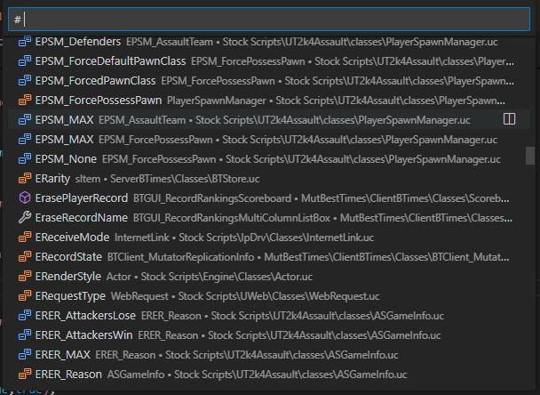

# UnrealScript Language Service

## 0.8.2 (July 24, 2024)

This hotfix mostly addresses problems with type checking (when 'check types' is enabled) and other minor issues:

- Fixed [#190](https://github.com/EliotVU/UnrealScript-Language-Service/issues/190)
- Fixed [#189](https://github.com/EliotVU/UnrealScript-Language-Service/issues/189)
- Fixed [#188](https://github.com/EliotVU/UnrealScript-Language-Service/issues/188)
- Fixed [#187](https://github.com/EliotVU/UnrealScript-Language-Service/issues/187)

In order to fix all of the listed issues above, the type checking had to be expanded to validate and consider 'variables' modifiers, and as a result more incompatible types should be reported; but this may also cause more false-positives to be reported in cases where the data is incomplete (i.e. macros)

- Fixed [#182; "Declaring static array size from variable fails in some cases"](https://github.com/EliotVU/UnrealScript-Language-Service/issues/182)

## 0.8.1 (Juni 16, 2024)

- (check types) Fixed false-positive `Type 'Object' and 'None' are incompatible with operator '!='`
this occurred due a false 'same-cost' operator match for `Interface` types; furthermore supported type checking for `Interface` types.
- (check types) Fixed false-positive `Type 'Struct' and 'Struct' are incompatible with operator '=='` this occurred when comparing structs that have no overloaded '=='
- Fixed minor issues with completion suggestions, e.g. when writing `begin object name=<carret>` etc.
- Fixed minor syntax highlighting issues, and added unit tests.
- Fixed error popup 'names cannot be falsy' when writing multiple variables.
- Fixed parenthesis `()` are no longer required for an `assert` statement.
- Restricted grammar parsing of multiline assignments and parameter assignments to UE3 (set `generation` to 3 to enable)

## 0.8.0 (Juni 7, 2024)

- Improvements made to type checking
  - The type checker will now calculate the lowest cost for each operator given the type of its operands, meaning the correct overloaded operator will be selected, if any. If multiple operators have an identical cost, then the types are reported as 'incompatible' just like the compiler. This however still needs further polishments in regards to 'Interface' types.
- Improvements made to completion suggestions
  - Suggest class, struct, or state name when writing `extends <qualified.identifier>`
  - Suggest overridable state names when writing `state <identifier>`
  - Suggest all known class modifiers when writing a class declaration.
  - Suggest all ignorable functions when writing `ignores <identifier, identifier>`
  - General improvements to context filtering.
- Improvements made to syntax highlighting
  - Added highlighting for missing UE1 keywords (localized, expand (in struct and state), always (replication if)).
- Improvements made to parsing
  - Parsing now respects the configured `generation` setting, meaning it won't parse keywords or grammar rules if the set generation does not have that keyword or grammar rule.
- Improvements made to semantic syntax highlighting.
- Improvements made to diagnostics, including new diagnostics:
  - Report if a deprecated `field` is referenced.
  - Report if an operator cannot be found.
  - (check types) Report if the operator is found, but no overload can be matched.
  - (check types) Report if a class type cannot be cast or assigned to an unrelated class type, also report if the cast is redundant.
- Quality of Life
  - General improvements made to parsing and indexing as to better align with the UnrealScript compiler's way of things.
  - If a `.uc` document has no `classes` in its path, then the containing directory's name will be used instead to represent the package name.
  - Displaced all default configured `intrinsicSymbols` with preset folders (predefined .uc documents) contained within the extension's package.
  - Fixed missing `Write` document highlighting of variables that are assigned by operators (other than '=')
  - Fixed marked the `Index` parameter of an array iterator as `optional`
  - Fixed missing coercing of return types for (UT2004) `CreateDataObject` and `LoadDataObject`, also unrestricted `Spawn` to coerce for any function named `Spawn` just like the compiler.
  - Fixed coercing of `Object` properties `Outer` and `Class` ['Name' Does not exist on type 'Core.Class'](https://github.com/EliotVU/UnrealScript-Language-Service/issues/16)
  - Fixed [Expression does not evaluate to an iteratable](https://github.com/EliotVU/UnrealScript-Language-Service/issues/164)
  - Fixed [Type not found when assigning to a sub object if using an object literal](https://github.com/EliotVU/UnrealScript-Language-Service/issues/168)
  - Fixed [Objects and Subobjects show errors in defaultproperties](https://github.com/EliotVU/UnrealScript-Language-Service/issues/170)
  - Fixed [Show const hints for strings](https://github.com/EliotVU/UnrealScript-Language-Service/issues/177)
  - Fixed [Casting to a class may mismatch a package (or class) of the same name](https://github.com/EliotVU/UnrealScript-Language-Service/issues/180)
  - Fixed ["mismatched input 'if' expecting 'until'"](https://github.com/EliotVU/UnrealScript-Language-Service/issues/186)

## 0.7.1 (Juni 29, 2023)

- Removed configuration of "filenamePatterns"

## 0.7.0 (Juni 29, 2023)

- Implemented signature help, providing assistance with function call arguments.
- Added two new customizable options to control the debounce period time, allowing users to specify the delay until analysis and/or indexing initiates after a document edit.
- Added underlining to comments in tooltips.
- Added an icon for .uc files.
- Expanded semantic highlighting to encompass additional symbol kinds.
- Improved symbol lookup functionality for default value assignments.
- Fixed an issue that prevented renaming of a symbol if it was a reference.
- Fixed a minor completion keyword-suggestion issue when assigning a default value to a property.
- Fixed a bug where analysis wouldn't detect invalid arguments in function calls if the function hadn't been analyzed yet.

### TypeChecking (see option "unrealscript.checkTypes")

- Added diagnostics for self-casting or casting to invalid types, as well as validation of dynamic casting in switch expressions.
  - Bug: May produce false positives when an overloaded operator is mismatched.

## 0.6.4 (Feb 16, 2023)

- Fixed [Class-function field hint](https://github.com/EliotVU/UnrealScript-Language-Service/issues/161).
- Fixed [Type checking error when passing an Enum object to a function as argument](https://github.com/EliotVU/UnrealScript-Language-Service/issues/166).
- Fixed [Enum tag reference in a condition expression produces an error when type checking is enabled](https://github.com/EliotVU/UnrealScript-Language-Service/issues/167).
- Fixed [Request textDocument/documentSymbol failed](https://github.com/EliotVU/UnrealScript-Language-Service/issues/169).
- [Add a new diagnostic for UC3 enum based element dimensions; and fix the misplaced range for array dimension diagnostics.](https://github.com/EliotVU/UnrealScript-Language-Service/commit/97e7b1ec9dbd62ae98c81f473a79f20826f18ac5).
- [Fail auto detection when no Object.uc document is present](https://github.com/EliotVU/UnrealScript-Language-Service/commit/1d64bc3771c5e23fa34f9624962e6567d197e879).

## 0.6.3 (Feb 10, 2023)

- Fixed an issue with skipLine() failing on UnrealScript directives i.e. "#exec obj load ..."

## 0.6.2 (Feb 9, 2023)

- Implemented an option to enable auto-detection of the UnrealScript language generation that's being used by the workspace.
- Implemented a new code-action to inline a constant's evaluated value.

- Quality of Life
  - General improvements to how indexing of documents is handled.
  - Fixed parser support for string types that have a fixed size e.g. ```String[255]``` (UE1).
  - Fixed type ```Pointer``` will be no longer recognized if the language is set to generation 3 (this has been displaced by the Core.Object.Pointer struct).
  - Fixed [No symbols found](https://github.com/EliotVU/UnrealScript-Language-Service/issues/157)

## 0.6.1 (Jan 29, 2023)

- The service will now register .u/.upk (the extensions are configurable) files as known package symbols, this means such packages will be included in the auto-completion and indexing of references.
  - Note: The contents of the packages are not yet indexed.

- Implemented [Auto-insert when overriding a function](https://github.com/EliotVU/UnrealScript-Language-Service/issues/153).
- Further improvements have been made to the auto-completion suggestions.

## 0.6.0 (Jan 26, 2023)

- Implemented [LSP Semantic-Tokens #137](https://github.com/EliotVU/UnrealScript-Language-Service/issues/137) (References to a class will now be highlighted as such even where the tmLanguage cannot determine the identifier's type)
  - 

- Implemented [LSP Workspace Symbols #148](https://github.com/EliotVU/UnrealScript-Language-Service/issues/148)
  - 

- Added [UnrealScript snippets #149](https://github.com/EliotVU/UnrealScript-Language-Service/issues/149).

- Typing, major improvements have been made to the type-checking system, there are almost no false-positive errors anymore!
- Archetypes, overall better support for "begin object" constructions.
- Better and more responsive auto-completion suggestions.

- Quality of Life
  - Overall improvements have been made to UnrealScript parsing.
  - Overall improvements to UnrealScript syntax highlighting.
  - Fixed [(DefaultProperties) Issue with structs written on multiple lines](https://github.com/EliotVU/UnrealScript-Language-Service/issues/138).
  - Fixed an issue where a Function call in a member context ```Outer.SomeIdentifier(...)``` could mismatch a Class's name.
  - Partially fixed an issue (in some cases) where a Function/Class invocation could be mistaken for one another.
  - Fixed LSP/documentSymbol [VSCode's Sticky scroll feature](https://github.com/EliotVU/UnrealScript-Language-Service/issues/148).
  - Fixed an issue that caused the document transformer to abort when trying to build a property with bad type-grammar (actually usually triggered by use of  macros).

## 0.5.0 (Nov 8, 2021)

- Autocomplete and IntelliSense
  - Has been displaced with the help of a third-party library [c3](https://github.com/mike-lischke/antlr4-c3).
  - This switch has made it much easier to implement context-aware autocompletes, but more work will be needed to bring it the quality that we all take for granted in popular languages.

- Added the first CodeAction
  - If a type is missing where a class type is expected, the service will now suggest to generate the class for you.

- Syntax highlighting has seen some improvements
  - C++ highlighting in cpptext and structcpptext and fragments.
  - Various tweaks.

- Added missing parameters to UC3 Array intrinsics

    ```UnrealScript
    // This should no longer output a missing argument error.
    ArrayRef.find(value)
    ```

- NameOf and ArrayCount with an expressive argument are now recognized

    ```UnrealScript
    // Even works in const assignments!
    const MY_ARRAYCOUNT              = arraycount(class'Object'.default.ObjectInternal);
    const MY_NAMEOF                  = nameof(class'Object'.default.ObjectInternal);
    ```

- Intrinsic (a relict of UC1) is now a recognized keyword for variables

    ```UnrealScript
    var intrinsic int myInteger;
    ```

- Added a new configuration option
  - Licensee - Epic|XCom

    This option tells the service which UnrealScript edition it should optimize for.

- Quality of Life
  - Fixed [Closing unopened comment](https://github.com/EliotVU/UnrealScript-Language-Service/issues/28).
  - Fixed ["default:" is not highlighted](https://github.com/EliotVU/UnrealScript-Language-Service/issues/22).
  - Fixed ["Spawn" return type is not coerced to its first parameter's type. #21](https://github.com/EliotVU/UnrealScript-Language-Service/issues/21).
  - Fixed ["no viable alternative at input 'return A -='"](https://github.com/EliotVU/UnrealScript-Language-Service/issues/20).
  - Fixed [Highlighting issue regarding a comment if on the same line as a struct declaration #19](https://github.com/EliotVU/UnrealScript-Language-Service/issues/19).
  - Fixed [Class and package name confusion](https://github.com/EliotVU/UnrealScript-Language-Service/issues/15).
  - Fixed ["const ref" argument confusing the parser](https://github.com/EliotVU/UnrealScript-Language-Service/issues/14).
