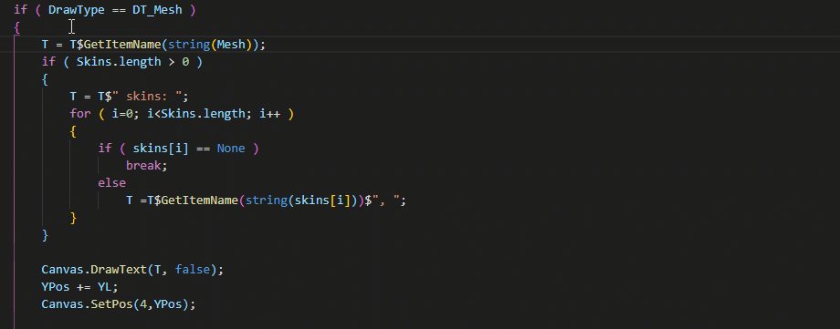

# UnrealScript

## Features

This is a work-in-progress extension for Visual Studio Code, its goal is to bring a rich editing experience to UnrealScript, the Unreal Engine's domain specific language.

So far the extension has implemented support for the following features:

* Semantic Syntax Highlighting
* Diagnostics (linting)
* Symbol Searching
* Symbol Renaming
* Find All References
* Go to Definition, Peek Definition
* Quick Info (hover tooltips)
* Auto-Completion
* Code-Actions (create new class)

## How to build

1. Clone this repository.
2. Ensure you have the latest [NodeJS 18](https://nodejs.org/en/download)
3. Run `npm install` in the root directory of the cloned repository (where the package.json is located)
4. Open the root directory in Visual Studio Code.
5. Launch the task `Launch Client` (shortcut **F5**)
6. If all went right, a new instanced window of Visual Studio Code should appear and be running the extension.
7. After making any changes, press (CTRL+Shift+P) and look for "Restart Extension Host" to re-run the extension with the new changes.

## Contribution

Yes! For more information regarding contribution, please check the [Contributing Guidelines](.github/CONTRIBUTING.md).

