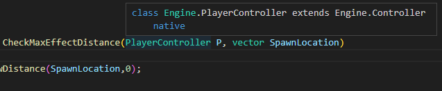
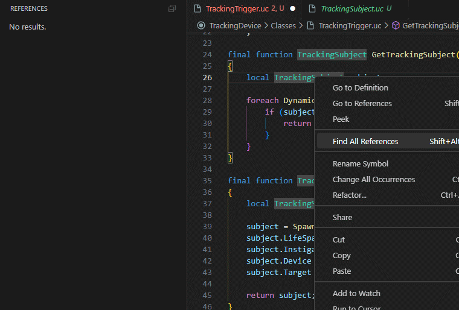
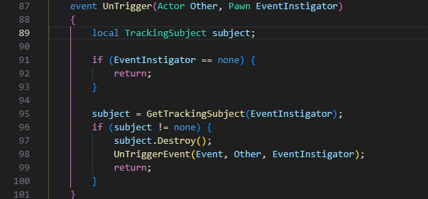

# UnrealScript

## Features

This is a work-in-progress extension for Visual Studio Code, its goal is to bring a rich editing experience to UnrealScript, the Unreal Engine's domain specific language.

So far the extension has implemented support for the following features:

* Semantic Syntax Highlighting
* Document Symbol Highlighting (Write, Read)
* Go to Definition, Peek Definition
* Context Auto-Completion
* Code-Actions
  * Create class
  * Inline constant
* Diagnostics (linting)

### Quick Info

### Find All References

Enable `Index All Documents` to find references for the entire workspace.

### Symbol Renaming

Enable `Index All Documents` to rename symbols for the entire workspace.

### Symbol Searching

Enable `Index All Documents` to search symbols for the entire workspace.

## Advice

For the best results it is advised to work from within a `workspace` and to add all the project dependencies to the workspace, such as the root path for `Core/Classes` and `Engine/Classes`
And even better, add the scripts `.u` and `.upk` content folders to the `workspace` this will make the extension aware of such packages in indexing and auto completion (but not its contents yet)

## Contribution

Yes! For more information regarding contribution, please check the [Contributing Guidelines](./.github/CONTRIBUTING.md).

